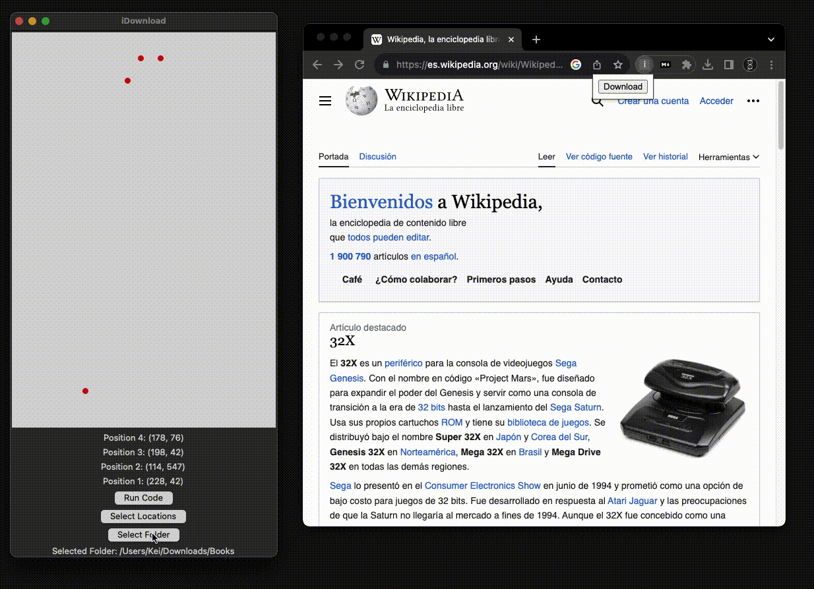

# iDownload

Toolkit to download pages as .md books with their images.

## How it works

### iDownload Chrome extension

This is a Chrome extension that downloads the images from the current page in the downloads folder. These images are grouped in Images directory, created within downloads folder. Upon finializing the downloading, it closes the current tab and adds a file Download.txt to downloads folder.


### Markdownload extension

You will also need the Markdownload chrome extension to download the md file. Make sure you have disabled the images, we already have our iDownload extension for that, but keep the Image Style. We will need the references to integrate our own image.


### iDownload.py 


This is the most important part. It offers a TKinter GUI app to run a specific script. The process is the following:

1. Select a directory containing a .txt with the book's url for each book to download.


2. Select 4 points to click.


3. The script will automatically click these 4 points, downloading the .md with the 
Markdownload extension, and the images with our iDownload extension.



4. Uppon finishing the downloads, the names and addresses will be updated, stored ina file for that "chapter", and included in the book's directory.
5. Finally when finishing with one .txt file (a.k.a book) it will move the book directory to the desktop.
6. Process will be repeated until all .txt files are covered.


## How to Use `iDownloader.py` Script

Clone the repository, activate a virtual environment, and execute the `iDownloader.py` script.

### Step 1: Clone the Repository

1. Open your terminal or command prompt.

2. Navigate to the directory where you want to clone the repository using the `cd` command:

```bash
cd /path/to/desired/directory
```

3. Clone the repository using git. If you don't have Git installed, you can download it from https://git-scm.com/. You can also use Github Desktop.

```
git clone https://github.com/khachimarur80/iDownload.git
```

### Step 2: Set Up a Virtual Environment

1. Navigate into the cloned repository's directory:

```
cd iDownload
```

2. Activate the virtual environment.

```
source venv/bin/activate
```

### Step 3: Execute the Script

With the virtual environment activated, you're ready to execute the iDownloader.py script:

```
python iDownloader.py
```

Now, you have successfully cloned the repository, set up a virtual environment, and executed the script.

